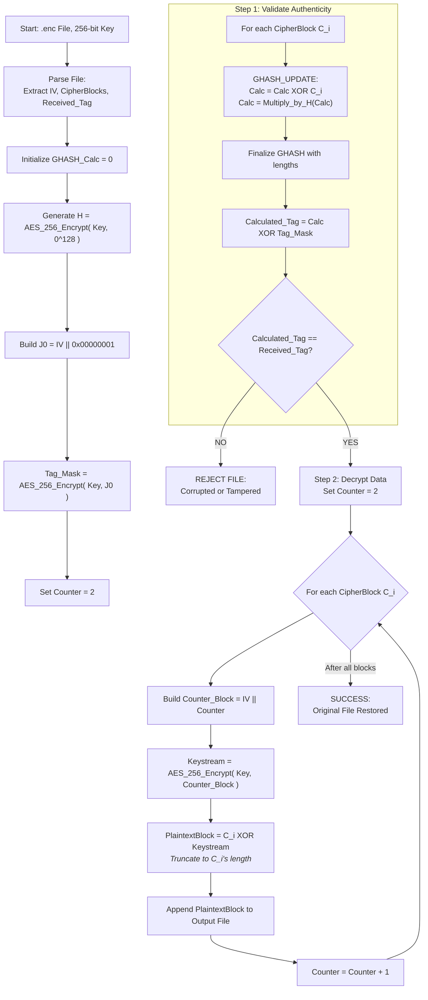

```mermaid
flowchart TD
    A[Start: .enc File, 256-bit Key] --> B[Parse File:<br>Extract IV, CipherBlocks, Received_Tag];
    B --> C[Initialize GHASH_Calc = 0];
    C --> D["Generate H = AES_256_Encrypt( Key, 0^128 )"];
    D --> E["Build J0 = IV || 0x00000001"];
    E --> F["Tag_Mask = AES_256_Encrypt( Key, J0 )"];
    F --> G[Set Counter = 2];
    
    subgraph Step1_Validation [Step 1: Validate Authenticity]
        direction TB
        G1[For each CipherBlock C_i] --> G2["GHASH_UPDATE:<br>Calc = Calc XOR C_i<br>Calc = Multiply_by_H(Calc)"];
        G2 --> G3[Finalize GHASH with lengths];
        G3 --> G4[Calculated_Tag = Calc XOR Tag_Mask];
        G4 --> G5{Calculated_Tag == Received_Tag?};
    end

    G5 -- NO --> G6[REJECT FILE:<br>Corrupted or Tampered];
    G5 -- YES --> H[Step 2: Decrypt Data<br>Set Counter = 2];
    H --> I{For each CipherBlock C_i};
    I --> J["Build Counter_Block = IV || Counter"];
    J --> K["Keystream = AES_256_Encrypt( Key, Counter_Block )"];
    K --> L[PlaintextBlock = C_i XOR Keystream<br><i>Truncate to C_i's length</i>];
    L --> M[Append PlaintextBlock to Output File];
    M --> N[Counter = Counter + 1];
    N --> I;
    I -- After all blocks --> O[SUCCESS:<br>Original File Restored];
```