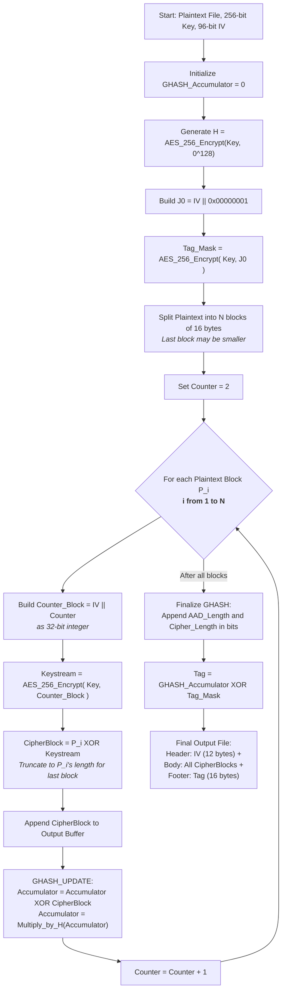

```mermaid
flowchart TD
    A["Start: Plaintext File, 256-bit Key, 96-bit IV"] --> B[Initialize GHASH_Accumulator = 0];
    B --> C["Generate H = AES_256_Encrypt(Key, 0^128)"];
    C["Generate H = AES_256_Encrypt(Key, 0^128)"];
    C --> D["Build J0 = IV || 0x00000001"];
    D --> E["Tag_Mask = AES_256_Encrypt( Key, J0 )"];
    E --> F[Split Plaintext into N blocks of 16 bytes<br><i>Last block may be smaller</i>];
    F --> G[Set Counter = 2];
    G --> H{For each Plaintext Block P_i<br><b>i from 1 to N</b>};
    H --> I["Build Counter_Block = IV || Counter<br><i>as 32-bit integer</i>"];
    I --> J["Keystream = AES_256_Encrypt( Key, Counter_Block )"];
    J --> K[CipherBlock = P_i XOR Keystream<br><i>Truncate to P_i's length for last block</i>];
    K --> L[Append CipherBlock to Output Buffer];
    L --> M["GHASH_UPDATE:<br>Accumulator = Accumulator XOR CipherBlock<br>Accumulator = Multiply_by_H(Accumulator)"];
    M --> N[Counter = Counter + 1];
    N --> H;
    H -- After all blocks --> O[Finalize GHASH:<br>Append AAD_Length and Cipher_Length in bits];
    O --> P[Tag = GHASH_Accumulator XOR Tag_Mask];
    P --> Q["Final Output File:<br>Header: IV (12 bytes) +<br>Body: All CipherBlocks +<br>Footer: Tag (16 bytes)"];
```